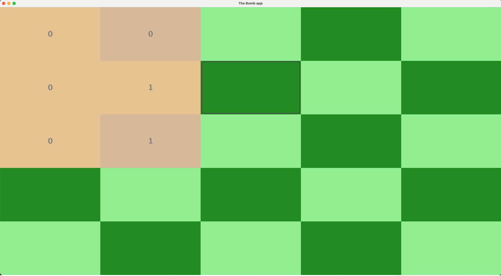
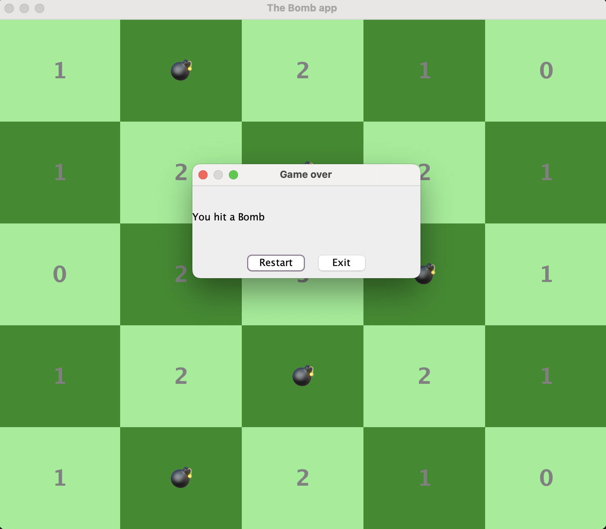

# 🎮 MineSweepers

This is a simple Minesweeper-style Java GUI game that tracks scores and uses a grid layout.  
The game features a user interface built with Java Swing, handles tile events, game states.

---

## 📸 Screenshot




---

## 🎥 Demo Video

[](https://youtu.be/fuPFk4dbub4)

---

## ✨ Features

- 🔘 Dynamic buttons with colored and bold text
- 🧠 Minesweeper-style logic with adjacent bomb count
- 👨‍💻 Built with Java Swing

---
### 🔧 Requirements

- Java 8+
- Any IDE or just use terminal

### 🖥️ Run with Terminal

```bash
javac JavaGui.java
java JavaGui
